<a id="top"></a>

<p align="center">
  <picture>
    <source media="(prefers-color-scheme: dark)" srcset="docs/assets/hero-dark.svg">
    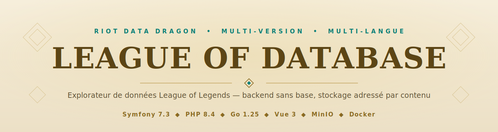
  </picture>
</p>

<p align="center">
  <a href="https://creativecommons.org/licenses/by-nc/4.0/"></a>
  <a href="https://symfony.com/"></a>
  <a href="https://php.net/"></a>
  <a href="https://go.dev/"></a>
  <a href="https://vuejs.org/"></a>
  <a href="https://tailwindcss.com/"></a>
  <a href="https://www.docker.com/"></a>
</p>

<p align="center">
  <b>Explorateur web des données <a href="https://leagueoflegends.com">League of Legends</a></b> — champions, objets, runes et sorts d'invocateur,<br>
  pour <b>chaque version</b> et <b>chaque langue</b> du jeu. Backend Symfony <b>sans base de données</b> (proxy sur le CDN Data Dragon),<br>
  passerelle Go et stockage objet adressé par contenu.
</p>

---

<a id="sommaire"></a>
##  Sommaire

Ce README est organisé en **deux parties** indépendantes :

<table>
  <tr>
    <td width="60"></td>
    <td><b><a href="#partie-1--design">Partie 1 — Design</a></b><br><sub>Découverte, review visuelle — captures de chaque page (desktop + mobile)</sub></td>
  </tr>
  <tr>
    <td></td>
    <td><b><a href="#partie-2--architecture">Partie 2 — Architecture</a></b><br><sub>Contributeurs, tech leads — schémas Mermaid, flux de données, décisions</sub></td>
  </tr>
</table>

**Raccourcis :** [Démarrage rapide](#demarrage-rapide) · [Stack technique](#stack-technique) · [Documentation](#documentation) · [Licence](#licence)

---

<a id="partie-1--design"></a>
##  Partie 1 — Design

Interface **responsive** sur **Tailwind CSS 4** (du petit mobile 320 px à l'iPad — voir [Responsive & mobile](docs/responsive-mobile.md)), **PWA installable** (manifest + service worker), îlots interactifs **Vue 3**, typographie officielle (*Beaufort for LoL* + *Spiegel*). Les visuels vivent dans [`screenshot/`](screenshot/) et sont régénérables via Playwright (`node tools/screenshots/capture.mjs`).

>  *Les captures sont des instantanés de l'état actuel — remplaçables librement, les chemins restent stables.*

###  Navigation visuelle

| Écran | Aperçu |
|---|---|
| [Sélection version / langue](#ecran-1) | Onboarding |
| [Accueil](#ecran-2) | Aperçu multi-ressources |
| [Listes](#ecran-3) | Champions · Objets · Runes · Sorts |
| [Pages de détail](#ecran-4) | Fiche complète par ressource |
| [Chargement temps réel](#ecran-5) | Loader SSE déterminé |

---

<a id="ecran-1"></a>
###  Sélection version / langue

> Sélecteur de patch et de langue logé dans l'en-tête (popover), accessible depuis n'importe quelle page. La sélection est mémorisée en session **et** portée dans l'URL (liens partageables).

<p align="center">
  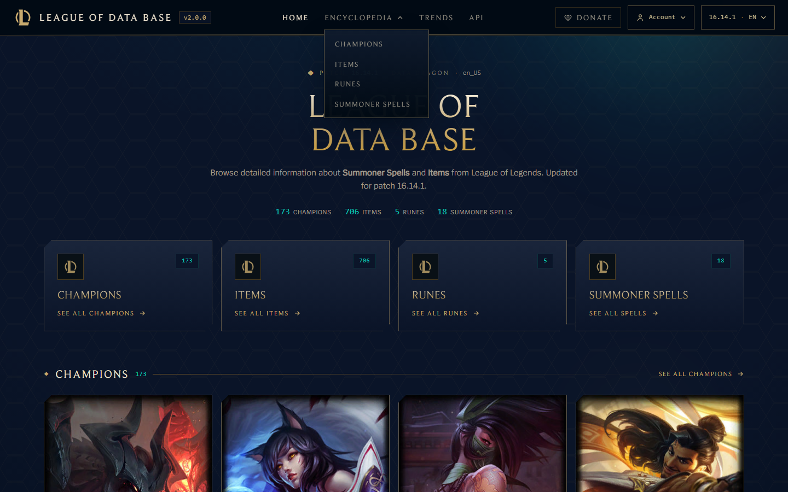
</p>

<details>
<summary> &nbsp;Version mobile</summary>
<p align="center">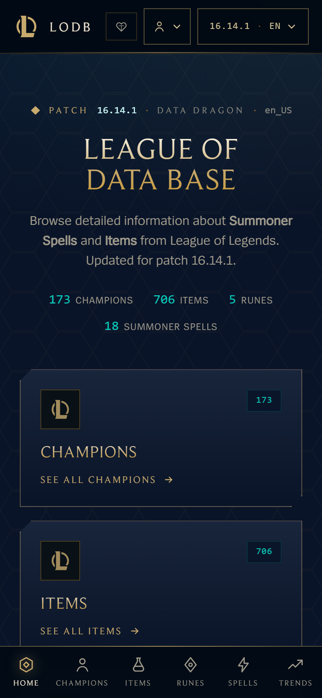</p>
</details>

---

<a id="ecran-2"></a>
###  Accueil

> Aperçu condensé des quatre familles de ressources (4 éléments chacune), recherche globale et accès direct aux listes complètes.

<p align="center">
  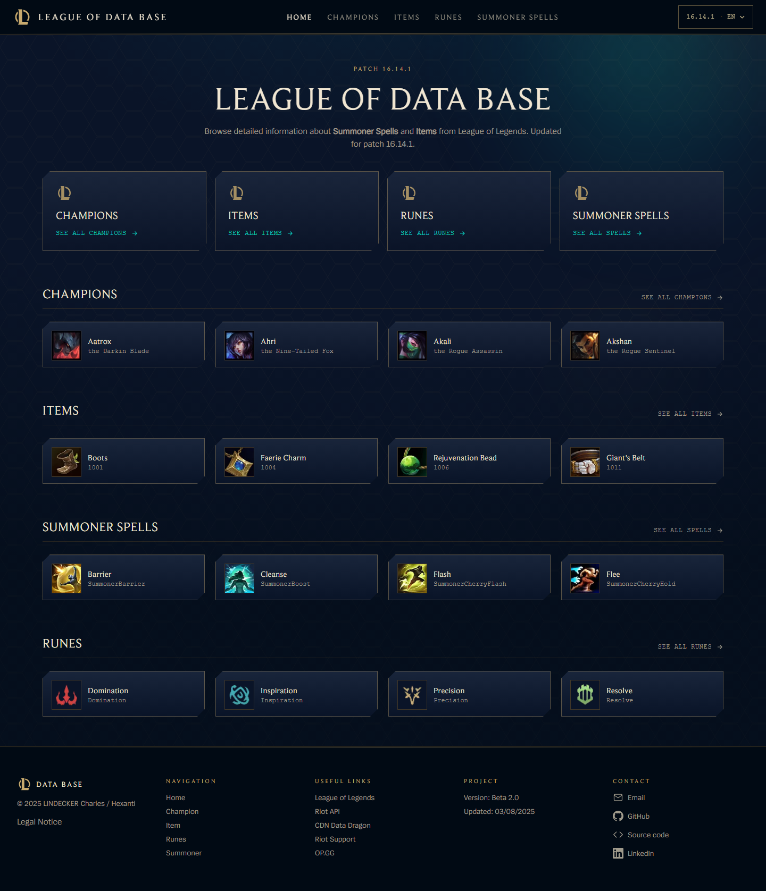
</p>

<details>
<summary> &nbsp;Version mobile</summary>
<p align="center">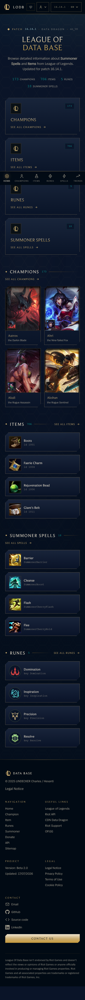</p>
</details>

---

<a id="ecran-3"></a>
### 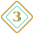 Listes — Champions · Objets · Runes · Sorts

> Grilles paginées avec contrôles de tri / taille de page. Les images se chargent en flux (voir [loader temps réel](#ecran-5)).

<table>
  <tr>
    <td width="50%"><b>Champions</b><br>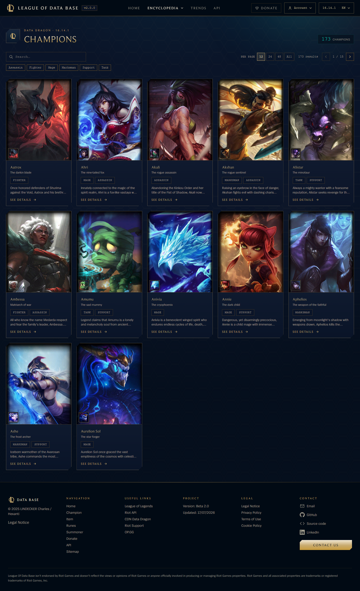</td>
    <td width="50%"><b>Objets</b><br>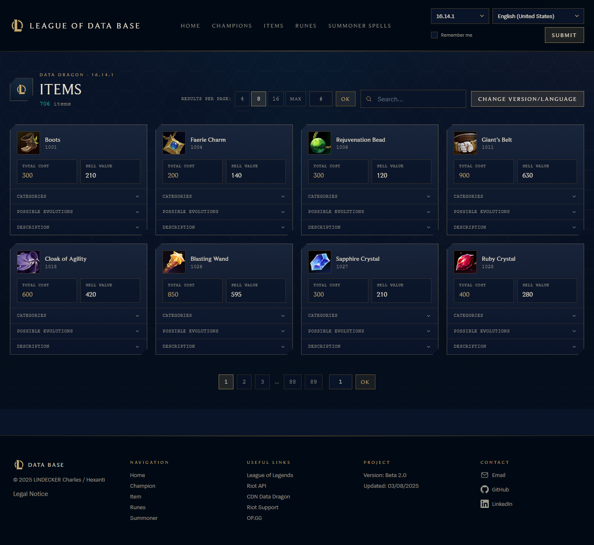</td>
  </tr>
  <tr>
    <td width="50%"><b>Runes</b><br>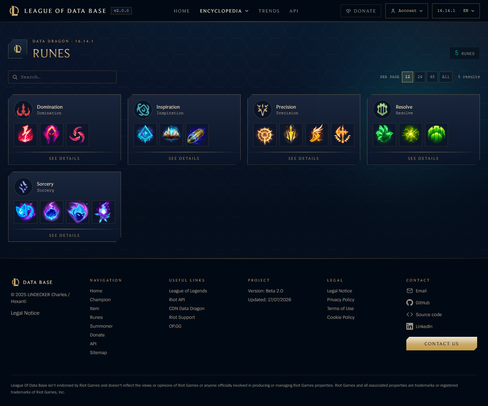</td>
    <td width="50%"><b>Sorts d'invocateur</b><br>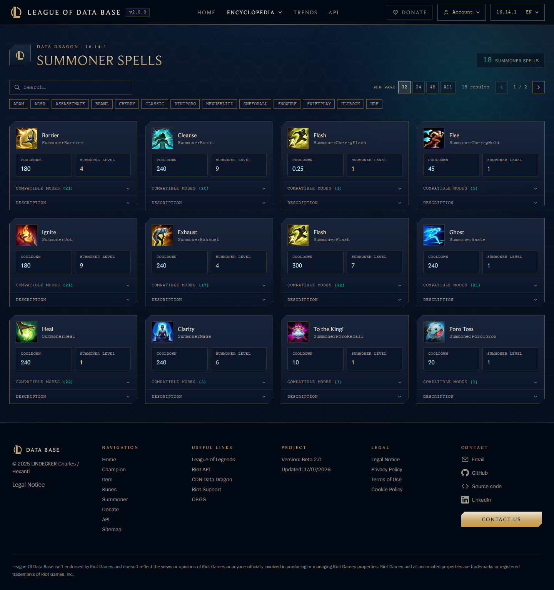</td>
  </tr>
</table>

<details>
<summary> &nbsp;Versions mobile — les 4 listes</summary>
<table>
  <tr>
    <td align="center"><b>Champions</b><br>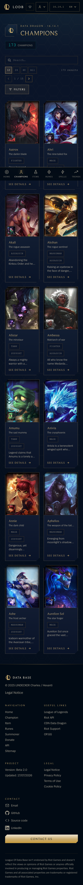</td>
    <td align="center"><b>Objets</b><br></td>
    <td align="center"><b>Runes</b><br>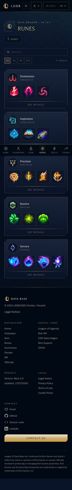</td>
    <td align="center"><b>Sorts</b><br>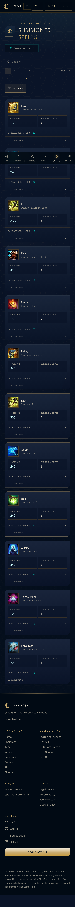</td>
  </tr>
</table>
</details>

---

<a id="ecran-4"></a>
###  Pages de détail

> Fiche riche par ressource : hero, statistiques, images haute résolution (splash art direct CDN pour les champions), et pour les skins → bande interactive de **chromas** (îlot Vue `ChromaStrip`, métadonnées CommunityDragon).

<table>
  <tr>
    <td width="50%"><b>Champion</b><br>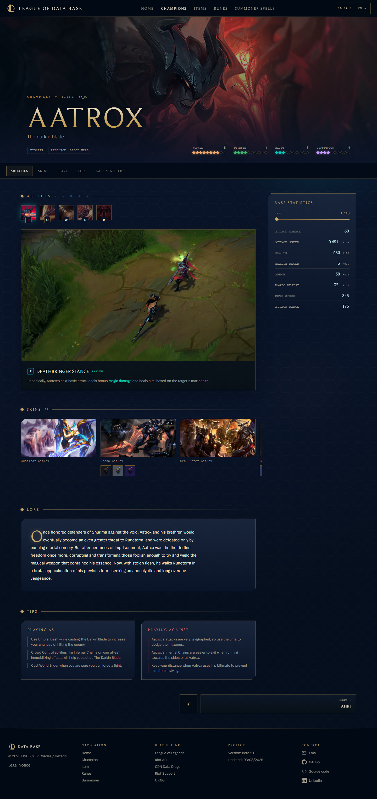</td>
    <td width="50%"><b>Objet</b><br>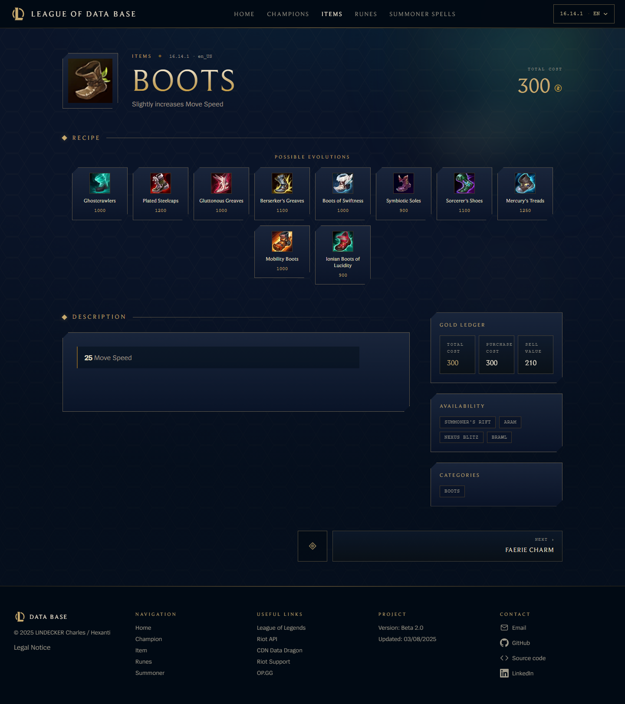</td>
  </tr>
  <tr>
    <td width="50%"><b>Rune</b><br>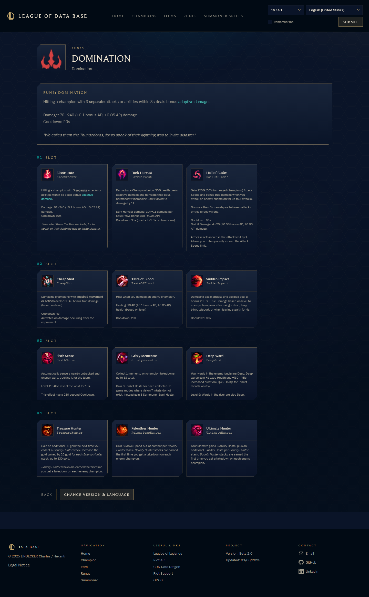</td>
    <td width="50%"><b>Sort d'invocateur</b><br>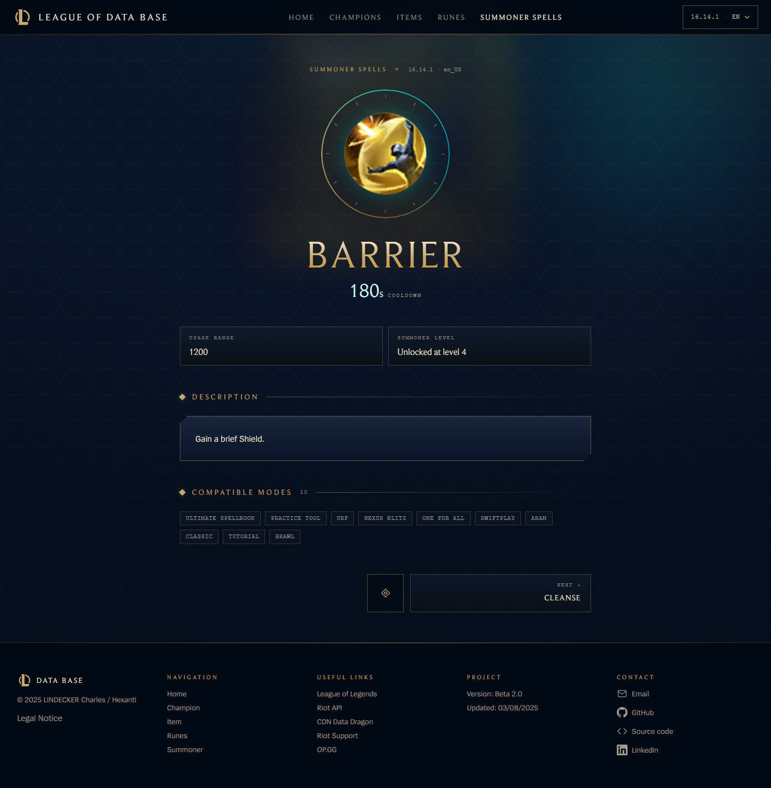</td>
  </tr>
</table>

<details>
<summary> &nbsp;Versions mobile — les 4 détails</summary>
<table>
  <tr>
    <td align="center"><b>Champion</b><br>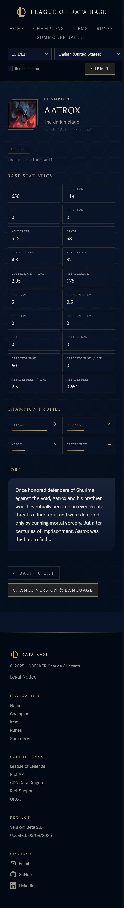</td>
    <td align="center"><b>Objet</b><br>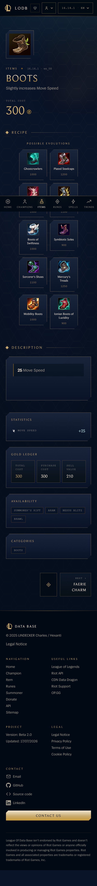</td>
    <td align="center"><b>Rune</b><br></td>
    <td align="center"><b>Sort</b><br>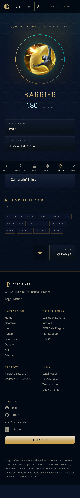</td>
  </tr>
</table>
</details>

---

<a id="ecran-5"></a>
###  Chargement temps réel

> Avant une navigation, un overlay **Server-Sent Events** préchauffe les images de la page de destination et affiche une **barre déterminée** nommant chaque ressource à mesure qu'elle atterrit dans le stockage objet. La visite Turbo n'a lieu qu'une fois la page « chaude ».

<p align="center">
  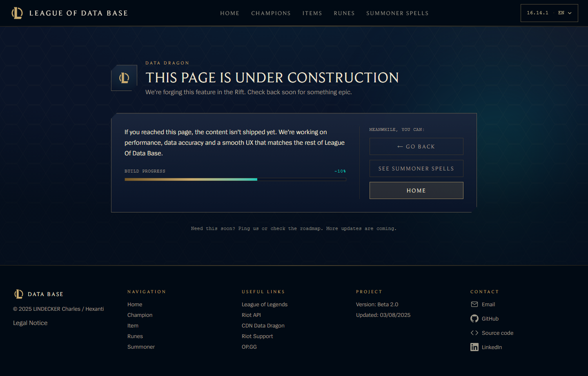
</p>

<details>
<summary> &nbsp;Version mobile</summary>
<p align="center">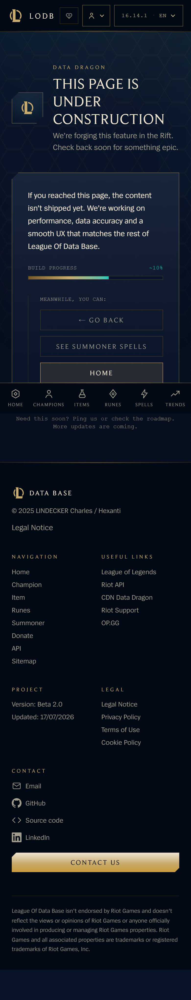</p>
</details>

<p align="right"><a href="#top"> retour au sommet</a></p>

---

<a id="partie-2--architecture"></a>
##  Partie 2 — Architecture

<a id="stack-technique"></a>
###  Stack technique

| | Couche | Technologie | Rôle |
|---|---|---|---|
|  | **Edge** | Caddy | Entrée publique, TLS automatique (déploiement) |
|  | **Reverse proxy** | nginx | Front HTTP ; sert `/cdn` (MinIO), `/build`, `/fonts`, streaming SSE |
|  | **Backend** | Symfony 7.4 · PHP 8.4 (FPM) | Application, **sans base de données** — proxy sur Data Dragon |
|  | **Microservice** | Go 1.25 | Passerelle de *fetch* : egress DDragon, garde SSRF, batch parallèle |
|  | **Frontend** | Twig + Vue 3 (TS) + Vite · Tailwind 4 | Coques Twig + îlots Vue montés dynamiquement |
|  | **Stockage** | MinIO (S3) | Images adressées par contenu (SHA-256), déduplication native |
|  | **Mail (dev)** | Mailpit | SMTP + UI de test |
|  | **DevOps** | Docker Compose · GitHub Actions → GHCR | Build, CI, images publiées |
|  | **Tests** | PHPUnit · `go test` · Vitest · Playwright | Backend, gateway, îlots Vue, captures |

**Principe directeur :** aucune donnée n'est stockée en base. L'application se comporte comme un **cache intelligent multi-niveaux** devant le CDN Data Dragon de Riot, avec un stockage objet dédupliqué pour les binaires.

---

<a id="vue-densemble"></a>
###  Vue d'ensemble (services & réseau)

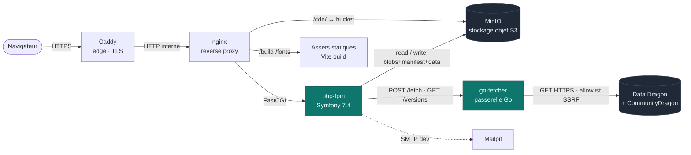
```mermaid
flowchart LR
    U([Navigateur]) -->|HTTPS| Caddy[Caddy<br/>edge · TLS]
    Caddy -->|HTTP interne| Nginx[nginx<br/>reverse proxy]

    Nginx -->|FastCGI| PHP[php-fpm<br/>Symfony 7.4]
    Nginx -->|/cdn/ → bucket| MinIO[(MinIO<br/>stockage objet S3)]
    Nginx -->|/build /fonts| Static[Assets statiques<br/>Vite build]

    PHP -->|POST /fetch · GET /versions| Go[go-fetcher<br/>passerelle Go]
    PHP -->|read / write blobs+manifest+data| MinIO
    PHP -.->|SMTP dev| Mail[Mailpit]

    Go -->|GET HTTPS · allowlist SSRF| DDragon[(Data Dragon<br/>+ CommunityDragon)]

    classDef ext fill:#1f2937,stroke:#4b5563,color:#e5e7eb
    classDef core fill:#0f766e,stroke:#134e4a,color:#ecfeff
    class DDragon,MinIO ext
    class PHP,Go core
```

**Points clés**

- **Seul `go-fetcher` sort du réseau.** Symfony ne parle jamais directement à Riot : tout l'egress passe par la passerelle Go, qui applique une **allowlist SSRF** (`ddragon.leagueoflegends.com`, `raw.communitydragon.org`) et impose `https`.
- **nginx sert les images directement depuis MinIO** via `location /cdn/` → `proxy_pass http://minio:9000/ddragon/`. Les clés étant des SHA-256 (contenu immuable), le cache est posé à `Cache-Control: public, immutable` sur **1 an**.
- **Pas de base de données** : les seuls états persistés sont dans MinIO (JSON, blobs, manifestes).

---

<a id="structure"></a>
###  Structure du dépôt

```
LeagueOfDataBaseFinal/
├── app/                        # Application Symfony
│   ├── src/
│   │   ├── Controller/         # Home, Champion, Item, Rune, Summoner, Loader (SSE), Admin
│   │   ├── Service/
│   │   │   ├── API/            # AbstractManager + managers par ressource
│   │   │   ├── Client/         # Version, Client (session), PageContextResolver
│   │   │   ├── Storage/        # BlobStore, DeferredImageIngestor, ImageTranscoder…
│   │   │   ├── Tools/          # GoFetcherClient, UrlGenerator, Utils
│   │   │   └── I18n/           # Résolution de locale UI
│   │   ├── EventSubscriber/    # LocaleSubscriber
│   │   ├── EventListener/      # FlushDeferredImagesListener (kernel.terminate)
│   │   └── Security/           # Auth admin
│   ├── assets/vue/             # Îlots Vue 3 (TS) : ResourceLoader, SearchAutocomplete…
│   └── templates/              # Coques Twig + composants
├── go-workers/                 # Microservice Go (fetch gateway)
│   └── internal/{api,fetcher,config}/
├── docker/                     # Dockerfiles + confs (php, nginx, minio)
├── infra/edge/                 # Caddy (déploiement)
├── screenshot/                 # Captures (Partie Design)
└── docs/                       # Documentation détaillée
```

---

<a id="managers"></a>
###  Managers de ressources (backend)

Chaque famille de données (champion, item, rune, summoner) est gérée par un **manager** héritant d'`AbstractManager`, qui centralise le cache, la résolution d'images et l'ingestion.

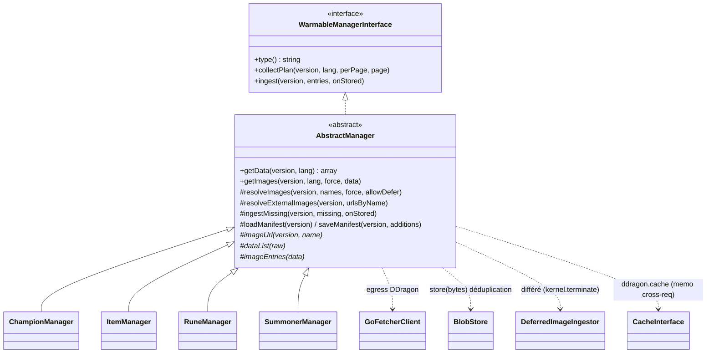
```mermaid
classDiagram
    class WarmableManagerInterface {
        <<interface>>
        +type() string
        +collectPlan(version, lang, perPage, page)
        +ingest(version, entries, onStored)
    }
    class AbstractManager {
        <<abstract>>
        +getData(version, lang) array
        +getImages(version, lang, force, data)
        #resolveImages(version, names, force, allowDefer)
        #resolveExternalImages(version, urlsByName)
        #ingestMissing(version, missing, onStored)
        #loadManifest(version) / saveManifest(version, additions)
        #imageUrl(version, name)*
        #dataList(raw)*
        #imageEntries(data)*
    }
    WarmableManagerInterface <|.. AbstractManager
    AbstractManager <|-- ChampionManager
    AbstractManager <|-- ItemManager
    AbstractManager <|-- RuneManager
    AbstractManager <|-- SummonerManager

    AbstractManager ..> GoFetcherClient : egress DDragon
    AbstractManager ..> BlobStore : store(bytes) déduplication
    AbstractManager ..> DeferredImageIngestor : différé (kernel.terminate)
    AbstractManager ..> CacheInterface : ddragon.cache (memo cross-req)
```

Les méthodes `abstract` (`imageUrl`, `dataList`, `imageEntries`) sont les **seuls points de variation** par ressource — le reste (cache, dédup, manifeste, ingestion différée/streamée) est mutualisé (Template Method).

---

<a id="dataset"></a>
###  Résolution d'un dataset (JSON) — cache multi-niveaux

`getData()` sert un dataset immuable pour un couple `(version, lang)` en traversant les niveaux du moins cher au plus cher, et ne touche le réseau qu'en dernier recours.

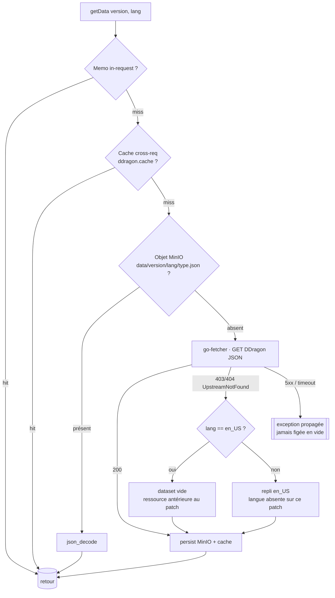
```mermaid
flowchart TD
    A[getData version, lang] --> B{Memo in-request ?}
    B -->|hit| Z[(retour)]
    B -->|miss| C{Cache cross-req<br/>ddragon.cache ?}
    C -->|hit| Z
    C -->|miss| D{Objet MinIO<br/>data/version/lang/type.json ?}
    D -->|présent| E[json_decode] --> Z
    D -->|absent| F[go-fetcher · GET DDragon JSON]
    F -->|200| G[persist MinIO + cache] --> Z
    F -->|403/404 UpstreamNotFound| H{lang == en_US ?}
    H -->|oui| I[dataset vide<br/>ressource antérieure au patch] --> G
    H -->|non| J[repli en_US<br/>langue absente sur ce patch] --> G
    F -->|5xx / timeout| K[[exception propagée<br/>jamais figée en vide]]
```

> **Décision** : une absence *définitive* (403/404) est persistée pour ne jamais re-solliciter le CDN (immuable). Une panne *transitoire* (5xx / timeout) remonte volontairement, pour ne pas geler un « vide » erroné.

---

<a id="images"></a>
###  Résolution & stockage des images (adressage par contenu)

Le cœur de la performance : chaque image est stockée **une seule fois**, indexée par le **SHA-256 de ses octets**. Deux versions partageant une image identique pointent le même blob — déduplication O(1), sans scan ni hard-links.

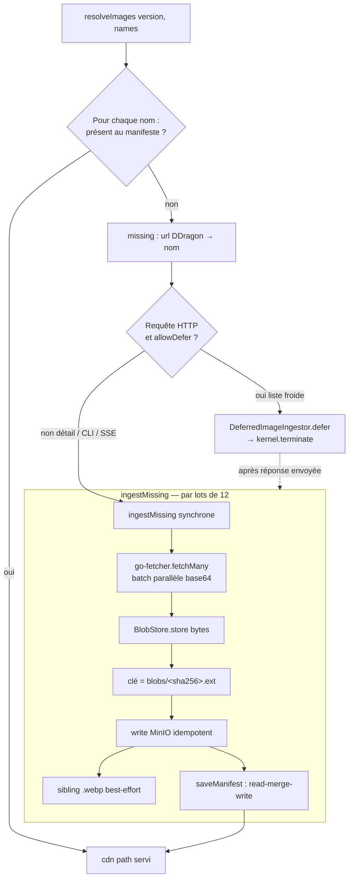
```mermaid
flowchart TD
    A[resolveImages version, names] --> B{Pour chaque nom :<br/>présent au manifeste ?}
    B -->|oui| R[cdn path servi]
    B -->|non| M[missing : url DDragon → nom]

    M --> D{Requête HTTP<br/>et allowDefer ?}
    D -->|oui liste froide| DEF[DeferredImageIngestor.defer<br/>→ kernel.terminate]
    D -->|non détail / CLI / SSE| ING[ingestMissing synchrone]

    subgraph ingestMissing[ingestMissing — par lots de 12]
        ING --> F[go-fetcher.fetchMany<br/>batch parallèle base64]
        F --> S[BlobStore.store bytes]
        S --> SHA["clé = blobs/&lt;sha256&gt;.ext"]
        SHA --> W[write MinIO idempotent]
        W --> WEBP[sibling .webp best-effort]
        W --> MAN[saveManifest : read-merge-write]
    end

    DEF -. après réponse envoyée .-> ingestMissing
    MAN --> R
```

**Trois espaces de clés dans MinIO :**

| Type | Clé | Rôle |
|---|---|---|
| **Données** | `data/{version}/{lang}/{type}.json` | Cache logique du dataset |
| **Blobs** | `blobs/{sha256}.{ext}` (+ `.webp`) | Images **dédupliquées** par contenu |
| **Manifeste** | `manifest/{version}/{type}.json` | `nom → chemin cdn` (lookup sans re-download) |

> **Idempotence** : la clé *étant* le hash des octets, le `PUT` est idempotent — pas de `HeadObject` avant écriture (une image identique se réécrit à l'identique, sans surcoût de round-trip). Le sibling WebP garde son check car il protège un transcodage GD coûteux.

---

<a id="warming"></a>
###  Deux chemins de préchauffage des images

Le rendu d'une liste **froide** ne bloque jamais l'utilisateur. Selon le contexte, l'ingestion est **différée** ou **streamée**.

```mermaid
flowchart LR
    subgraph P1[A · Rendu utilisateur froid]
        direction TB
        R1[Controller liste] --> R2[resolveImages allowDefer=true]
        R2 --> R3[Réponse immédiate<br/>placeholders]
        R3 -. kernel.terminate .-> R4[FlushDeferredImagesListener]
        R4 --> R5[ingestMissing<br/>→ prochaine visite chaude]
    end

    subgraph P2[B · Loader SSE avant navigation]
        direction TB
        S1[GET /api/loader/prepare] --> S2[session_write_close<br/>libère le verrou]
        S2 --> S3[collectPlan : total + manquants]
        S3 --> S4[ingest synchrone<br/>event 'item' par image]
        S4 --> S5[event 'done' → visite Turbo chaude]
    end
```

| | **A — Différé** | **B — Streamé (SSE)** |
|---|---|---|
| Déclencheur | Rendu d'une liste froide | Overlay loader avant navigation |
| Timing | Après la réponse (`kernel.terminate`) | Pendant, en flux |
| UX | Page immédiate + placeholders | Barre déterminée + noms live |
| Verrou session | Conservé | **Relâché** avant le flux (pas de starvation) |
| En CLI (warmup) | N/A (`shouldDefer()` = false) | Ingestion synchrone en une passe |

---

<a id="sse"></a>
###  Séquence du loader SSE

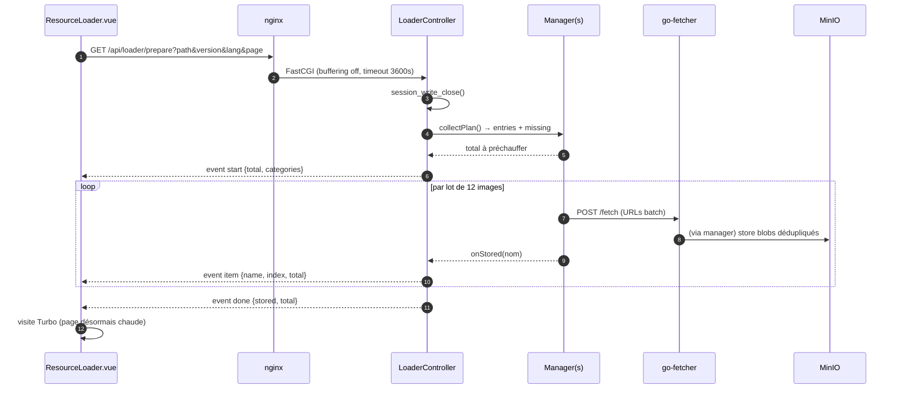
```mermaid
sequenceDiagram
    autonumber
    participant V as ResourceLoader.vue
    participant N as nginx
    participant L as LoaderController
    participant M as Manager(s)
    participant G as go-fetcher
    participant S as MinIO

    V->>N: GET /api/loader/prepare?path&version&lang&page
    N->>L: FastCGI (buffering off, timeout 3600s)
    L->>L: session_write_close()
    L->>M: collectPlan() → entries + missing
    M-->>L: total à préchauffer
    L-->>V: event start {total, categories}
    loop par lot de 12 images
        M->>G: POST /fetch (URLs batch)
        G->>S: (via manager) store blobs dédupliqués
        M-->>L: onStored(nom)
        L-->>V: event item {name, index, total}
    end
    L-->>V: event done {stored, total}
    V->>V: visite Turbo (page désormais chaude)
```

> nginx neutralise tout buffering sur cette route exacte (`fastcgi_buffering off`, `gzip off`, `fastcgi_read_timeout 3600s`) — le verrouillage du comportement SSE est **dans nginx**, pas seulement via l'en-tête `X-Accel-Buffering` de l'app.

---

<a id="frontend"></a>
###  Frontend — îlots Vue dans des coques Twig

Symfony garde le routage, le SEO et l'i18n ; seules les pièces interactives passent en Vue 3. Twig rend une coque `<div data-vue="nom" data-props="{…}">`, et `main.ts` **monte à la volée** le composant correspondant.

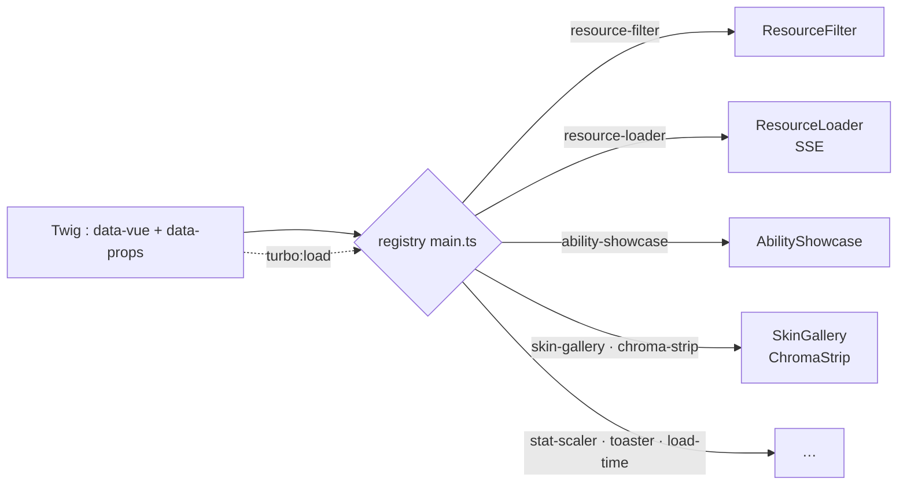
```mermaid
flowchart LR
    T[Twig : data-vue + data-props] --> R{registry main.ts}
    R -->|resource-filter| A[ResourceFilter]
    R -->|resource-loader| B[ResourceLoader<br/>SSE]
    R -->|ability-showcase| C[AbilityShowcase]
    R -->|skin-gallery · chroma-strip| D[SkinGallery<br/>ChromaStrip]
    R -->|stat-scaler · toaster · load-time| E[…]
    T -. turbo:load .-> R
```

- **Code-splitting** : chaque îlot est un `import()` dynamique du registry (`main.ts`) — une page ne télécharge que le JS des îlots qu'elle monte réellement.
- **Turbo Drive** : `main.ts` re-scanne les îlots après chaque navigation (`turbo:load`), pour un rechargement partiel sans full reload.

---

<a id="gateway"></a>
###  Passerelle Go — contrat & garanties

- **Endpoints** : `POST /fetch` (batch), `GET /versions`, `GET /languages`, `GET /healthz`.
- **Contrat unique JSON/binaire** : les corps sont **base64** sur le fil — images et JSON partagent le même schéma de réponse (`{results: [{url, status, content_type, body_base64, error}]}`).
- **Concurrence bornée** : sémaphore (`maxConcurrency`), ordre préservé, corps limité à 1 MiB, `MAX_URLS_PER_REQUEST` (défaut 512). Côté PHP, `GoFetcherClient` chunk à 200 URLs/batch.
- **SSRF** : `Allowed()` impose `https` + hôte dans l'allowlist avant toute requête.
- **Keep-alive** : le pool de connexions idle est dimensionné à la concurrence de fetch (le CDN images est HTTP/1.1 only → réutilisation TLS inter-vagues au lieu d'un handshake par requête).

---

<a id="locale"></a>
###  Locale, sessions & URLs

- **URL = fonction pure de son query** : `version` + `lang` sont portés dans l'URL (liens partageables, cachables), avec repli sur la sélection en session via `PageContextResolver`. Plus de bounce 302 « *_redirect ».
- **Locale UI** résolue en session à `kernel.request` (`LocaleSubscriber`) → réponses `Cache-Control: private` (pas de cache HTTP partagé aujourd'hui : ce serait un futur `s-maxage` + `ETag` avec la locale portée en URL).

<p align="right"><a href="#top"> retour au sommet</a></p>

---

<a id="demarrage-rapide"></a>
##  Démarrage rapide (Docker)

> Prérequis : **Docker** + **Docker Compose**. Node/PHP sur l'hôte ne servent qu'à préparer le bind-mount de dev (`vendor/` + build des assets).

```bash
# 1. Cloner
git clone https://github.com/LINDECKER-Charles/LeagueOfDataBaseFinal.git
cd LeagueOfDataBaseFinal

# 2. Configurer l'environnement (secrets CI : docs/github-actions-secrets.md)
cp .env.example .env

# 3. Pré-requis dev (le conteneur php bind-monte ./app)
cd app && composer install && npm ci && npm run build && cd ..

# 4. Lancer toute la stack (php-fpm, nginx, Go, MinIO, Mailpit)
docker compose up -d --build
```

**Services exposés (dev) :**

| Service | URL |
|---|---|
| Application | http://localhost:8080 |
| Console MinIO | http://localhost:9001 |
| Mailpit (mails) | http://localhost:8025 |
| Passerelle Go | http://localhost:8085/healthz |

Front avec HMR (optionnel) : `cd app && npm run dev`.
Captures Playwright : `node tools/screenshots/capture.mjs` → [`screenshot/`](screenshot/).

---

<a id="documentation"></a>
##  Documentation

| Doc | Contenu |
|---|---|
| [Installation](docs/setup.md) | Prérequis, installation détaillée, dépannage |
| [Architecture](docs/architecture.md) | Détail des services et flux |
| [Responsive &amp; mobile](docs/responsive-mobile.md) | Stratégie mobile, breakpoints, composants, méthode d'audit |
| [Docker](docs/docker.md) | Référence complète des commandes de la stack |
| [Configuration](docs/configuration.md) | Variables d'environnement |
| [Secrets CI](docs/github-actions-secrets.md) | Secrets GitHub Actions / GHCR |
| [Contribution](CONTRIBUTING.md) | Démarrage contributeur — [version détaillée FR/EN/ES](docs/contribution.md) |

---

<a id="contribuer"></a>
##  Contribuer

Les contributions sont les bienvenues — commencez par [`CONTRIBUTING.md`](CONTRIBUTING.md) (guide court et à jour), puis le [guide détaillé multilingue](docs/contribution.md) (FR / EN / ES). Toute contribution est distribuée sous [CC BY-NC 4.0](LICENSE).

<a id="support"></a>
##  Support

- **Email** : [charles.lindecker@outlook.fr](mailto:charles.lindecker@outlook.fr)
- **Issues** : [GitHub Issues](https://github.com/LINDECKER-Charles/LeagueOfDataBaseFinal/issues)

<a id="licence"></a>
##  Licence

**Creative Commons Attribution-NonCommercial 4.0 International (CC BY-NC 4.0)** — voir [le résumé de la licence](https://creativecommons.org/licenses/by-nc/4.0/).

---

<p align="center">
  <br>
  <sub><b>Made for the League of Legends community</b></sub><br><br>
  <a href="https://github.com/LINDECKER-Charles/LeagueOfDataBaseFinal"> Star</a>
  &nbsp;·&nbsp;
  <a href="https://github.com/LINDECKER-Charles/LeagueOfDataBaseFinal/issues"> Report Bug</a>
  &nbsp;·&nbsp;
  <a href="https://github.com/LINDECKER-Charles/LeagueOfDataBaseFinal/issues"> Request Feature</a>
</p>
