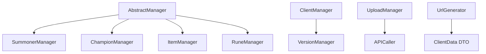
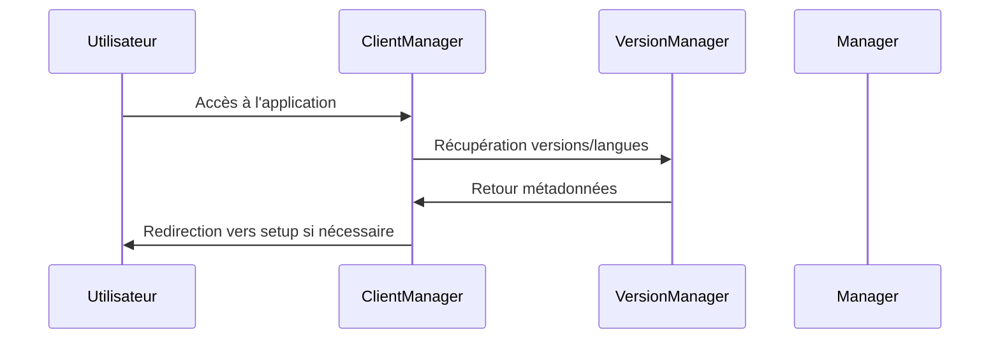
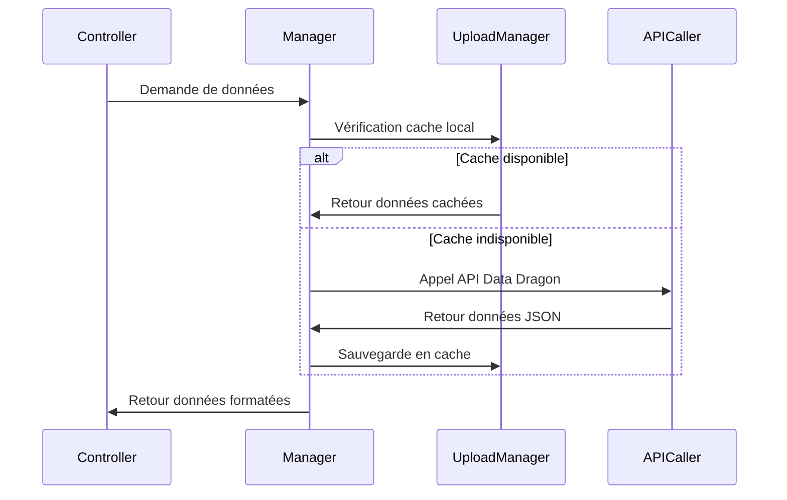
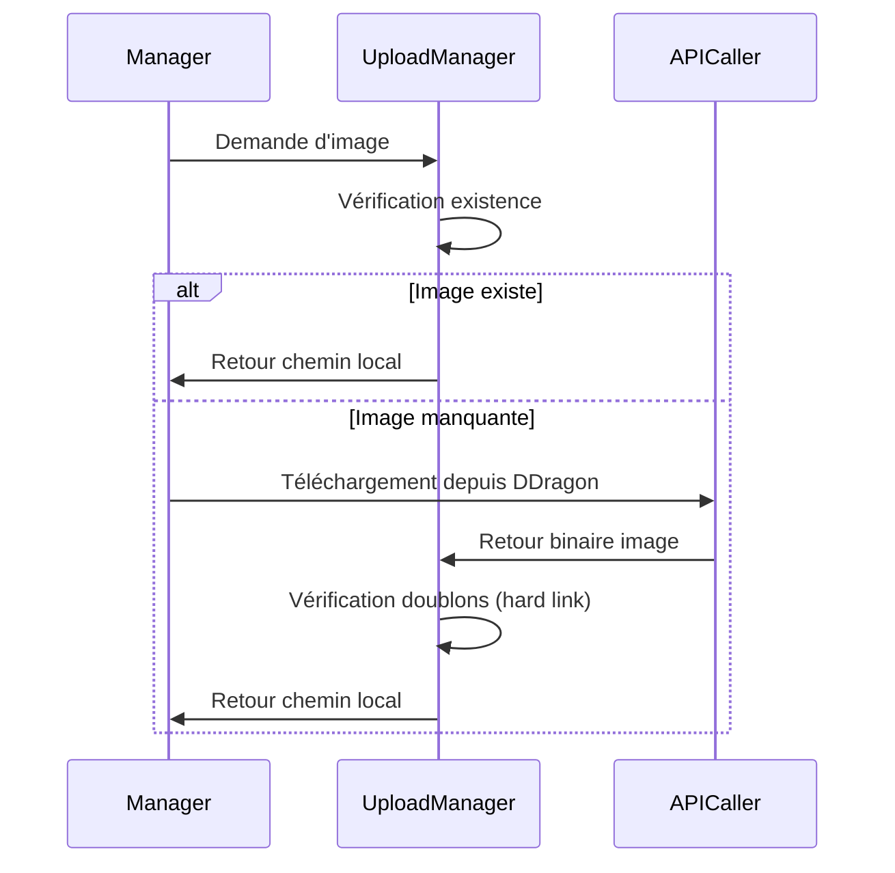

# 🏗️ Architecture du projet

## Vue d'ensemble

League of Database utilise une architecture modulaire basée sur Symfony 7, organisée autour de services spécialisés et d'une séparation claire des responsabilités.

## 📁 Structure du projet

```
league-of-database/
├── app/                          # Application Symfony principale
│   ├── src/
│   │   ├── Controller/          # Contrôleurs MVC
│   │   ├── Service/            # Services métier
│   │   │   ├── API/           # Gestionnaires de données externes
│   │   │   ├── Client/         # Gestion des clients et sessions
│   │   │   └── Tools/         # Utilitaires et helpers
│   │   ├── Dto/               # Data Transfer Objects
│   │   └── EventListener/    # Écouteurs d'événements
│   ├── templates/             # Templates Twig
│   ├── public/               # Assets publics et uploads
│   └── config/               # Configuration Symfony
├── go-workers/               # Workers Go pour le traitement asynchrone
├── docs/                    # Documentation
└── front-test/              # Tests frontend séparés
```

## 🔧 Architecture des services

### Hiérarchie des services



### Services principaux

#### 🎯 AbstractManager
**Rôle** : Classe abstraite de base pour tous les gestionnaires de données
- Définit les méthodes communes (cache, téléchargement, pagination)
- Implémente le pattern Template Method
- Gère la logique de cache avec hard links

#### 🏆 ChampionManager
**Rôle** : Gestion des données des champions
- Hérite d'`AbstractManager`
- Implémente `CategoriesInterface`
- Méthodes spécialisées : `getByName()`, `searchByName()`, `getImages()`

#### ⚔️ ItemManager
**Rôle** : Gestion des objets du jeu
- Structure similaire au ChampionManager
- Gestion des images et métadonnées des objets
- Support de la recherche et pagination

#### 🔮 SummonerManager
**Rôle** : Gestion des sorts d'invocateur
- Premier manager implémenté
- Modèle de référence pour les autres managers
- Gestion complète du cycle de vie des données

#### 🎨 RuneManager
**Rôle** : Gestion des runes reforgées
- Gestion des arbres de runes
- Support des images et descriptions
- Intégration avec le système de cache

### Services utilitaires

#### 👤 ClientManager
**Rôle** : Gestion des préférences utilisateur
- Détection automatique de la langue navigateur
- Gestion des sessions et cookies
- Hydratation des données client

#### 📊 VersionManager
**Rôle** : Gestion des versions et langues
- Récupération des versions disponibles depuis Data Dragon
- Validation des versions et langues
- Cache des métadonnées de version

#### 📁 UploadManager
**Rôle** : Gestion du stockage local
- Sauvegarde des JSON et images
- Optimisation avec hard links
- Gestion des répertoires par version/langue

#### 🌐 APICaller
**Rôle** : Client HTTP minimaliste
- Communication avec l'API Data Dragon
- Gestion des erreurs réseau
- Cache des réponses HTTP

## 🎨 Architecture frontend

### Templates Twig

```
templates/
├── base.html.twig           # Template de base
├── partials/               # Composants réutilisables
│   ├── header.html.twig
│   ├── navigation.html.twig
│   └── pagination.html.twig
├── home/                   # Pages d'accueil
├── champion/               # Pages champions
├── item/                   # Pages objets
├── summoner/               # Pages sorts d'invocateur
└── rune/                   # Pages runes
```

### Assets et styles

- **Tailwind CSS 4.1** : Framework CSS utilitaire
- **Stimulus** : Framework JavaScript léger
- **Turbo** : Navigation rapide sans rechargement
- **Webpack Encore** : Compilation des assets

## 🔄 Flux de données

### 1. Initialisation


### 2. Chargement des données


### 3. Gestion des images


## 🗄️ Système de stockage

### Architecture du stockage

```
public/upload/
├── {version}/
│   ├── champion_img/           # Images des champions (communes à toutes les langues)
│   ├── item_img/               # Images des objets (communes à toutes les langues)
│   ├── summoner_img/           # Images des sorts d'invocateur (communes à toutes les langues)
│   ├── rune_img/               # Images des runes (communes à toutes les langues)
│   └── {lang}/                 # Données JSON spécifiques à chaque langue
│       ├── champion.json
│       ├── item.json
│       ├── summoner.json
│       └── rune.json
```

### Optimisations

1. **Hard Links** : Évite la duplication d'images identiques entre versions
2. **Stockage local** : Toutes les données sont stockées sur le serveur
3. **Validation de version** : Vérification de la fraîcheur des données
4. **Compression** : Optimisation des images téléchargées

## 🔌 Intégration API

### Data Dragon Integration

```php
// Exemple d'intégration
$data = $this->aPICaller->call(
    "https://ddragon.leagueoflegends.com/cdn/{$version}/data/{$lang}/champion.json"
);
```

### Endpoints supportés

- **Champions** : `/cdn/{version}/data/{lang}/champion.json`
- **Items** : `/cdn/{version}/data/{lang}/item.json`
- **Summoner Spells** : `/cdn/{version}/data/{lang}/summoner.json`
- **Runes** : `/cdn/{version}/data/{lang}/runesReforged.json`
- **Images** : `/cdn/{version}/img/{type}/{name}.png`

## 🚀 Déploiement

### Environnements

- **Development** : Symfony CLI + Webpack 
- **Production** : Appache

### CI/CD Pipeline

```yaml
# GitHub Actions
- Installation PHP 8.2+
- Installation dépendances Composer
- Lint YAML/Twig/Container
- Tests PHPUnit
- Build assets production
- Déploiement automatique
```

## 📈 Performance et scalabilité

### Optimisations actuelles

1. **Stockage intelligent** : Réduction des appels API
2. **Hard links** : Économie d'espace disque
3. **Pagination** : Limitation des données chargées
4. **Compression** : Optimisation des assets

### Améliorations futures

1. **Base de données** : Persistance des données fréquentes
2. **Queue system** : Traitement asynchrone
3. **CDN** : Distribution des images
